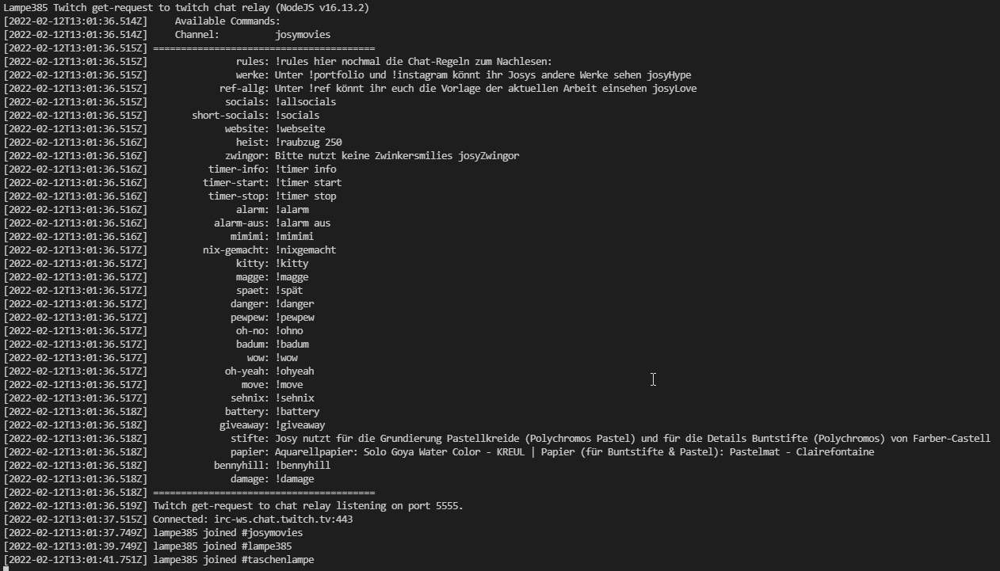

# Twitch Releay
Enables you to use your Stream Deck to post in other channels (than your own) without having to set the focus on the browser/chat window.

# How to use
Ensure you have Node.js installed and available in your PATH. See here for [windows](https://nodejs.org/en/download/) or here for [*nix](https://nodejs.org/en/download/package-manager/).

Download the repo whether by cloning it or downloading as zip (extract afterwards).

1. Rename the `commands.json.default` to `commands.json` and edit it to your hearts desire.
2. For each channel you want to send texts - setup a list of commands containing:
   1. name is the command name and the localhost endpoint
   2. response is the response that should be answered with
3. Get your personal oauth token [HERE](https://twitchapps.com/tmi/) - NEVER share it with anybody!
4. Rename `config.json.default` to `config.json`
5. Insert your oauth token in `config.json`
6. Add the channels you want to join in `config.json`
7. Open a terminal and navigate to the folder containing the project.
8. Install the required node modules with `npm install`
9. Run the relay with `node index.js`

You can stop your relay with `[Ctrl] + [C]`.

## Windows only
You can use the twitch-relay.bat to start your local relay.

To set it up correctly follow these instructions:
1. Rename `twitch-relay.bat.default` to `twitch-relay.bat`
2. Open the file `twitch-relay.bat`
3. Replace `PATH/TO/YOUR/FOLDER/` with the real path to your relay. (e.g.: C:\Users\lampe385\workspace\twitch-relay)
4. Save the file.
5. Execute the file.
6. You may need to allow it to communicate through the fire wall.

If everything worked you command prompt should look like this:

You can stop your relay with `[Ctrl] + [C]`.

# Setup your Stream Deck
Use the "website" action of your Stream Deck an configure it like shown below:

