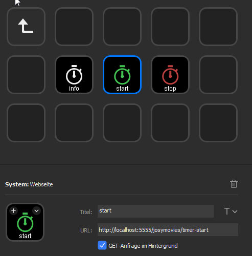

# Twitch Releay
Enables you to use your Stream Deck to post in other channels (than your own) without having to set the focus on the browser/chat window.

# How to use
Ensure you have Node.js installed and available in your PATH. See here for [windows](https://nodejs.org/en/download/) or here for [*nix](https://nodejs.org/en/download/package-manager/).

Download the repo whether by cloning it or downloading as zip (extract afterwards).

1. Edit the `commands.json` to your hearts desire.
   1. name is the command name and the localhost endpoint
   2. response is the response that should be answered with
2. Get your personal oauth token [HERE](https://twitchapps.com/tmi/) - NEVER share it with anybody!
3. Insert your oauth token in `settings.json`
4. Add the channels you want to join in `settings.json`
5. Open a terminal and navigate to the folder containing the project.
6. Install the required node modules with `npm install`
7. Run the relay with `node index.js --channel THE_CHANNEL_TO_ANSWER_IN`

`THE_CHANNEL_TO_ANSWER_IN` is the channel where the relay should send you responses to.

Example
```
node index.js --channel lampe385
```

You can stop your relay with `[Ctrl] + [C]`.

# Setup your Stream Deck
Use the "website" action of your Stream Deck an configure it like shown below:

